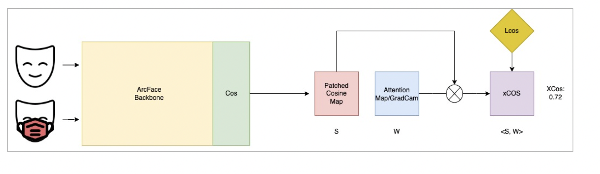

# MFR

* Working on creating ArcFace-based pipeline for masked face verification. Used computer vision techniques to synthetically generate masked face images in the training data
* Further, using explainable AI techniques to the model such as Ablation Cam to view the learnt feature maps and representations.
* Project done as part of BITS F464 Machine Learning. 

## Approach
<p align="center">

</p>

## Environment setup
```
git clone git@github.com:Shreyas-Bhat/MFR.git
cd MFR
```
## Training 
Please move to ```cd src/ ``` before following the steps.

```python main.py```
## Testing
The pretrained weights can be accessed at Google Drive. You can download it and place it under ```../pretrained_model/mfr/```

## Authors 
* Shreyas Bhat
* Aparajita Guha
* Tarun Varghese Mathew
